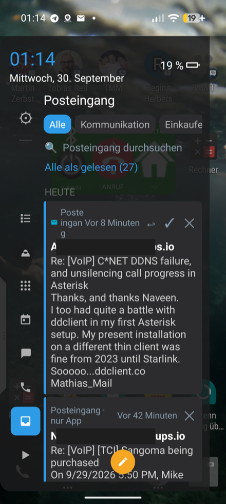
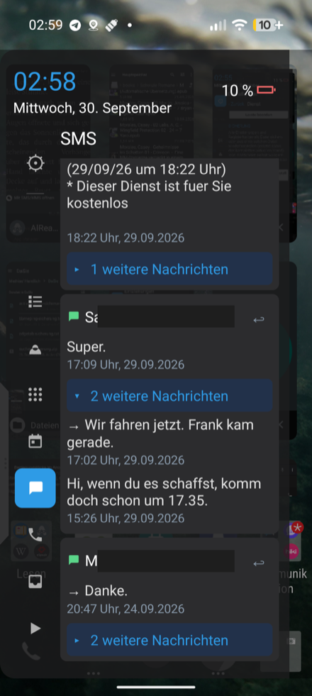
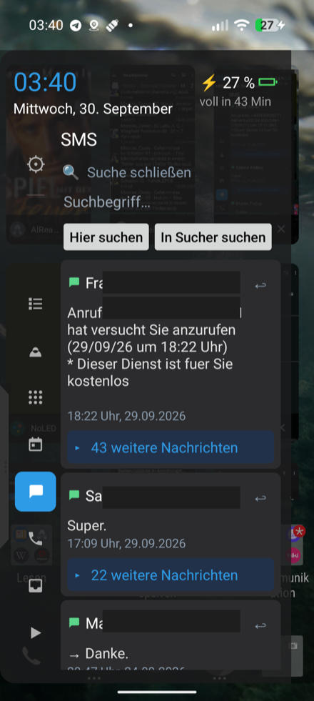
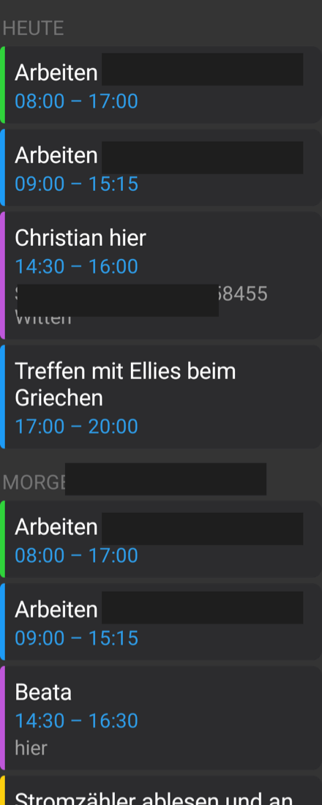
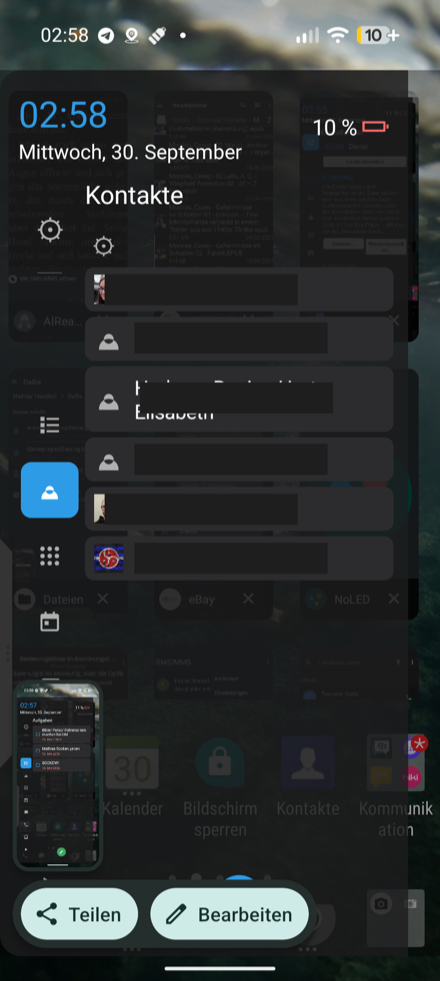
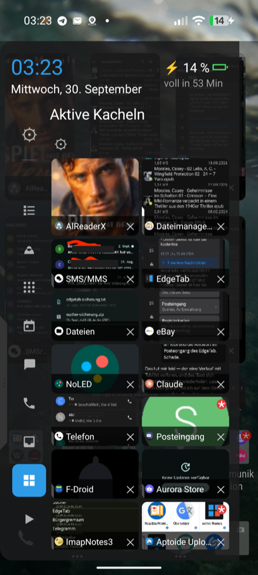
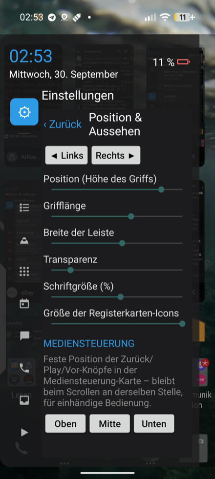
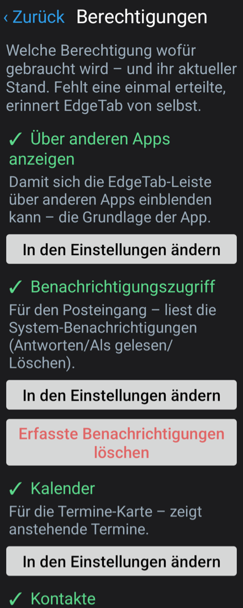

> 🇬🇧 **English:** [README.md](README.md) · 🇩🇪 **Deutsch:** README.de.md *(diese Seite)*

# EdgeTab

Eine von Grund auf neu geschriebene Android-Nachbildung von BlackBerrys
„Productivity Edge" — eine aufziehbare Randleiste mit frei konfigurierbaren
Karten (Kalender, Posteingang, App-Widgets, Verknüpfungen, Kontakte, Aufgaben,
Mediensteuerung, SMS, Anrufe und eine „Aktive Kacheln"-Karte). Es wird
nirgends BlackBerry-Code verwendet; jede Karte spricht ausschließlich mit
offenen, dokumentierten Android-Schnittstellen (`NotificationListenerService`,
`CalendarContract`, `ContactsContract`, `AppWidgetHost`, `MediaSessionManager`
und dem offenen Content-Provider von [JTX Board](https://jtx.techbee.at/) für
Aufgaben).

## Voraussetzungen

- Läuft ab **Android 10** aufwärts (Mindest-SDK 29), Ziel-SDK 34 (Android 14).
  Kein BlackBerry-Gerät nötig.

## Funktionen

- **Rand-Griff**: Tippen oder Wischen von einem der beiden Bildschirmränder
  öffnet die Leiste; Zurückwischen schließt sie. Das Aussehen entspricht
  BlackBerrys Original-Griff.
- **Mehrere, umsortierbare Tabs**: beliebig viele Widget- und
  Verknüpfungs-Tabs, jeder unabhängig benannt/mit Symbol, jeder mit eigener
  Einstellung „beim Tippen schließen".
- **Kalender**: die nächsten 7 Tage, nach Tag gruppiert; Tippen öffnet den
  Termin, die Schaltfläche öffnet den „Neuer Termin"-Bildschirm der
  System-Kalender-App.
- **Posteingang**: liest abgefangene Benachrichtigungen aus gewählten
  Quell-Apps (funktioniert gut mit BlackBerry Hub, Telegram, Signal usw.), nach
  Tag gruppiert. Antworten (über die eigene Aktion der Benachrichtigung, mit
  oder ohne Inline-RemoteInput-Texteingabe), Als-gelesen-markieren und Löschen
  (über die eigenen Aktionen der Benachrichtigung) lösen jeweils die echte
  Aktion in der Quell-App aus. Eine von Dir gesendete Antwort bleibt unter der
  Nachricht stehen (baut einen kleinen Verlauf auf) und ist davor geschützt,
  von einer „Beantwortet"-Bestätigung der Quell-App überschrieben zu werden.
  Jede Benachrichtigung wird **verlustfrei** gespeichert (alle Felder, die sie
  enthielt, über `Notifications.toJson` der gemeinsamen Bibliothek), nicht nur
  Titel und eine Zeile — so wird nichts Auswertbares weggeworfen. Zeigt das
  Symbol der Benachrichtigung und, bei Live-Benachrichtigungen, das große Bild
  (BigPictureStyle-Foto/Albumcover). Pro Quelle kannst Du EdgeTab anweisen, ein
  Löschen **nicht erneut auszulösen**, wenn die Benachrichtigung ohnehin schon
  aus der Statusleiste verschwunden ist (standardmäßig an für den BlackBerry
  Hub, der sich sonst bei veralteten Lösch-Aktionen fehlverhielt). Eine Lupe
  öffnet ein Suchfeld: „hier suchen" filtert den Posteingang, „in Sucher suchen"
  öffnet die Sucher-App mit dem Begriff für eine Volltextsuche über alles.
- **SMS & Anrufe**: Karten (optional auch inline im Posteingang) mit Deinen
  neuesten Textnachrichten / Deinem Anrufprotokoll. Anrufe zeigen den
  **Nummern-Typ aus Deinem Adressbuch** (mobil / Arbeit / privat …), Richtung
  und Zeit, farbcodiert (grün = verbunden, rot = verpasst, blau = ausgehend,
  aber nicht erreicht). Ein **kurzes Tippen wählt die Nummer** (braucht die
  „Anrufen"-Berechtigung, sonst öffnet sich der Wähler); ein **langes Drücken
  öffnet ein Menü** (anrufen, schreiben, in Kontakten öffnen, Nummer kopieren,
  aus dem Anrufprotokoll löschen). SMS gruppieren sich zu aufklappbaren
  Konversationen mit Inline-Antwort. Beide haben eine eigene Suche. Optional,
  Berechtigungen werden bei Bedarf angefragt.
- **App-Widgets**: binde jedes installierte Startbildschirm-Widget (z. B. den
  Posteingangs-Widget des BlackBerry Hub) direkt in die Leiste ein. Ein
  eingebettetes Widget wird nur angesteuert, **solange seine Karte tatsächlich
  offen ist**, sodass ein deaktivierter Tab oder eine geschlossene Leiste die
  Quell-App nicht zum Fehlverhalten bringen kann; **„Entfernen" löst die
  Bindung vollständig**.
- **Verknüpfungen**: reiner App-Icon-Starter, gruppiert, je Gruppe als Raster
  oder Liste.
- **Kontakte**: alle / eine handverlesene Teilmenge / nur Favoriten.
- **Aufgaben**: liest (und kann abhaken) Aufgaben aus
  [JTX Board](https://jtx.techbee.at/), das sie selbst via DAVx⁵/CalDAV von
  einem beliebigen Server holt.
- **Mediensteuerung**: zeigt und steuert aktive Mediensitzungen, mit einer
  positionsfesten Schnellsteuerungs-Karte (oben/mitte/unten, einstellbar) zur
  Erreichbarkeit mit dem Daumen der haltenden Hand.
- **Berechtigungen-Karte**: eine eigene Einstellungskarte listet jede
  verwendete Berechtigung, wofür sie da ist und ihren Status, mit Sprung zur
  passenden Systemeinstellung. Fehlt eine einmal erteilte Berechtigung wieder
  (z. B. nach einem OS-Update), erinnert EdgeTab mit einer Benachrichtigung, die
  anbietet, sie neu zu erteilen oder zu ignorieren. Der Posteingang lässt sich
  hier ebenfalls leeren. Hinweis: Wenn sich eine Berechtigung *ändert* (z. B.
  erweitert sie ein Update), musst Du sie einmal in den Android-Einstellungen
  entziehen und neu erteilen, sonst bleibt sie wirkungslos.
- **Einfügen per Langdruck**: ein langer Druck auf jedes Textfeld (Antwort,
  Suche …) fügt die Zwischenablage ein — die schwebende System-Auswahlleiste
  erscheint über dem Overlay-Fenster oft nicht.
- **„Nach oben"-Schaltfläche**: lange Listen bekommen eine zweite schwebende
  runde Schaltfläche, die nach oben springt; sie erscheint erst, wenn Du
  gescrollt hast, und beide schwebenden Schaltflächen sitzen gleichmäßig
  links/rechts der Mitte, an dem Bildschirmrand, an dem EdgeTab angedockt ist.

## Screenshots

<table>
<tr>
<td><br>Posteingang</td>
<td><br>SMS</td>
<td><br>SMS: Suche</td>
</tr>
<tr>
<td><br>Kalender</td>
<td><br>Kontakte</td>
<td><br>Aktive Kacheln</td>
</tr>
<tr>
<td><br>Einstellungen</td>
<td><br>Berechtigungen</td>
</tr>
</table>

## Bauen

Kein Gradle — dieses Projekt wird direkt mit den rohen
Android-SDK-Kommandozeilen-Werkzeugen gebaut. Du brauchst:

- Android SDK (`platforms;android-34`, `build-tools;34.0.0`, `platform-tools`)
- ein JDK (11+)
- einen eigenen Signier-Keystore — im Repository ist keiner enthalten. Mit
  `keytool` erzeugen:

  ```sh
  keytool -genkeypair -v -keystore keystore.p12 -storetype PKCS12 \
    -alias mykey -keyalg RSA -keysize 2048 -validity 10000
  ```

Dann aus dem Projektwurzelverzeichnis:

```sh
SDK=/pfad/zum/android/sdk
BT="$SDK/build-tools/34.0.0"
AJAR="$SDK/platforms/android-34/android.jar"

rm -rf build && mkdir -p build/gen build/obj
"$BT/aapt2" compile --dir res -o build/res.zip
"$BT/aapt2" link -o build/base.apk -I "$AJAR" --manifest AndroidManifest.xml \
  --java build/gen -R build/res.zip --auto-add-overlay \
  --min-sdk-version 29 --target-sdk-version 34
javac --release 11 -d build/obj -classpath "$AJAR" $(find src build/gen -name '*.java')
"$BT/d8" --min-api 29 --lib "$AJAR" --output build/ $(find build/obj -name '*.class')
cp build/base.apk build/unsigned.apk && (cd build && zip -qj unsigned.apk classes.dex)
"$BT/zipalign" -f -p 4 build/unsigned.apk build/aligned.apk
"$BT/apksigner" sign --ks keystore.p12 --ks-type PKCS12 \
  --out build/EdgeTab.apk build/aligned.apk
```

## Warum es das gibt

BlackBerry hat die Productivity-Edge-Funktion eingestellt; dieses Projekt
bildet ihren Geist für alle nach, die sie vermissen — nur mit öffentlichen
Android-APIs.

## Dokumentation

- **Deutsch:** [Anleitung](docs/EdgeTab-Anleitung.pdf) · [Werbung](docs/EdgeTab-Werbung.pdf)
- **English:** [User guide](docs/EdgeTab-Guide.pdf) · [Flyer](docs/EdgeTab-Flyer.pdf)

## Lizenz

GNU General Public License v3.0 (oder später) — siehe `LICENSE`.
