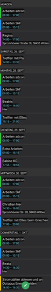
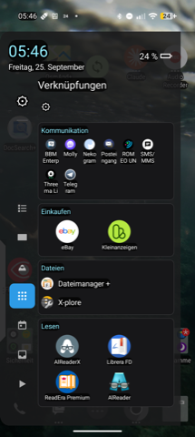
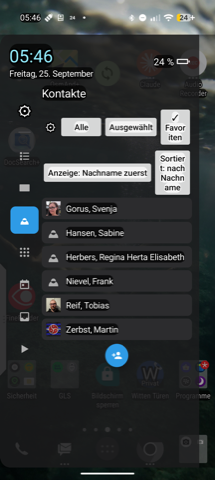
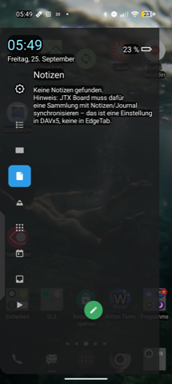
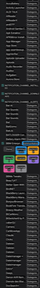
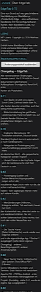

# EdgeTab

A from-scratch Android recreation of BlackBerry's "Productivity Edge" —
a swipeable edge-panel with configurable cards (Calendar, Inbox, App
Widgets, Shortcuts, Contacts, Tasks, Media Control). No BlackBerry code
is used anywhere; every card talks only to open, documented Android
interfaces (`NotificationListenerService`, `CalendarContract`,
`ContactsContract`, `AppWidgetHost`, `MediaSessionManager`, and
[JTX Board](https://jtx.techbee.at/)'s open content provider for tasks).

*Eine von Grund auf neu geschriebene Nachbildung von BlackBerrys
"Productivity Edge" für Android — eine aufziehbare Randleiste mit frei
konfigurierbaren Karten. Kein BlackBerry-Code, nur offene
Android-Schnittstellen.*

## Features

- **Edge handle**: tap or swipe from either screen edge to open the panel;
  swipe back to close. Visual design matches BlackBerry's original handle.
- **Multiple, reorderable tabs**: any number of Widget and Shortcuts tabs,
  each independently named/iconed, each with its own "close on tap" setting.
- **Calendar**: next 7 days, grouped by day, tap opens the event, floating
  button opens the system calendar app's own "new event" screen.
- **Inbox**: reads intercepted notifications from chosen source apps
  (works well with BlackBerry Hub, Telegram, Signal, etc.), grouped by day.
  Reply (via the notification's own action, with or without inline
  RemoteInput text entry) and delete (via the notification's own delete
  action) both trigger the real action in the source app.
- **App Widgets**: embed any installed home-screen widget (e.g. BlackBerry
  Hub's own inbox widget) directly in the panel.
- **Shortcuts**: pure app-icon launcher, grouped, grid or list per group.
- **Contacts**: all / a hand-picked subset / favourites only.
- **Tasks**: reads (and can check off) tasks from
  [JTX Board](https://jtx.techbee.at/), which itself gets them via
  DAVx⁵/CalDAV from any server.
- **Media control**: shows and controls active media sessions, with a
  fixed-position quick-control card (top/middle/bottom, configurable) for
  reachability with the thumb of the hand holding the phone.

## Screenshots

<table>
<tr>
<td><br>Kalender</td>
<td><br>Verknüpfungen (Shortcuts)</td>
<td><br>Kontakte (Sortierung/Anzeige)</td>
</tr>
<tr>
<td><br>Notizen</td>
<td><br>Einstellungen: Posteingang</td>
<td><br>Über EdgeTab</td>
</tr>
</table>

## Building

No Gradle — this project is built directly with the raw Android SDK
command-line tools (see `EdgeTab-Uebergabe2.md`, in German, for the full
history and rationale). You need:

- Android SDK (`platforms;android-34`, `build-tools;34.0.0`,
  `platform-tools`)
- A JDK (11+)
- Your own signing keystore — none is included in this repository. Create
  one with `keytool`:

  ```sh
  keytool -genkeypair -v -keystore keystore.p12 -storetype PKCS12 \
    -alias mykey -keyalg RSA -keysize 2048 -validity 10000
  ```

Then, from the project root:

```sh
SDK=/path/to/android/sdk
BT="$SDK/build-tools/34.0.0"
AJAR="$SDK/platforms/android-34/android.jar"

rm -rf build && mkdir -p build/gen build/obj
"$BT/aapt2" compile --dir res -o build/res.zip
"$BT/aapt2" link -o build/base.apk -I "$AJAR" --manifest AndroidManifest.xml \
  --java build/gen -R build/res.zip --auto-add-overlay \
  --min-sdk-version 29 --target-sdk-version 34
javac --release 11 -d build/obj -classpath "$AJAR" $(find src build/gen -name '*.java')
"$BT/d8" --min-api 29 --lib "$AJAR" --output build/ $(find build/obj -name '*.class')
cp build/base.apk build/unsigned.apk && (cd build && zip -qj unsigned.apk classes.dex)
"$BT/zipalign" -f -p 4 build/unsigned.apk build/aligned.apk
"$BT/apksigner" sign --ks keystore.p12 --ks-type PKCS12 \
  --out build/EdgeTab.apk build/aligned.apk
```

## Why this exists

BlackBerry discontinued the Productivity Edge feature; this project
recreates its spirit for anyone who misses it, using only public Android
APIs. See `EdgeTab-Uebergabe2.md` for the full, detailed (German)
development history, including several deep-dive reverse-engineering
investigations into what is and isn't possible on modern Android.

## License

GNU General Public License v3.0 (or later) — see `LICENSE`.
